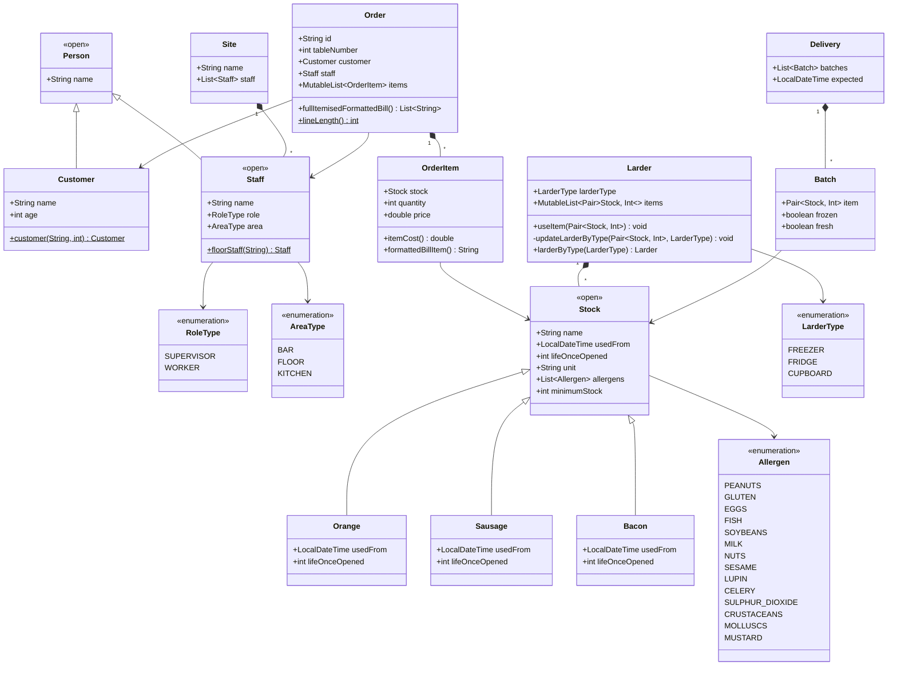

# class diagram

```mermaid
classDiagram
    class Person {
        <<open>>
        +String name
    }

    class Customer {
        +String name
        +int age
        +customer(String, int)$ Customer
    }

    class Staff {
        <<open>>
        +String name
        +RoleType role
        +AreaType area
        +floorStaff(String)$ Staff
    }

    class RoleType {
        <<enumeration>>
        SUPERVISOR
        WORKER
    }

    class AreaType {
        <<enumeration>>
        BAR
        FLOOR
        KITCHEN
    }

    class Site {
        +String name
        +List~Staff~ staff
    }

    class Order {
        +String id
        +int tableNumber
        +Customer customer
        +Staff staff
        +MutableList~OrderItem~ items
        +fullItemisedFormattedBill() List~String~
        +lineLength()$ int
    }

    class OrderItem {
        +Stock stock
        +int quantity
        +double price
        +itemCost() double
        +formattedBillItem() String
    }

    class Stock {
        <<open>>
        +String name
        +LocalDateTime usedFrom
        +int lifeOnceOpened
        +String unit
        +List~Allergen~ allergens
        +int minimumStock
    }

    class Allergen {
        <<enumeration>>
        PEANUTS
        GLUTEN
        EGGS
        FISH
        SOYBEANS
        MILK
        NUTS
        SESAME
        LUPIN
        CELERY
        SULPHUR_DIOXIDE
        CRUSTACEANS
        MOLLUSCS
        MUSTARD
    }

    class Larder {
        +LarderType larderType
        +MutableList~Pair~Stock, Int~~ items
        +useItem(Pair~Stock, Int~) void
        -updateLarderByType(Pair~Stock, Int~, LarderType) void
        +larderByType(LarderType) Larder
    }

    class LarderType {
        <<enumeration>>
        FREEZER
        FRIDGE
        CUPBOARD
    }

    class Batch {
        +Pair~Stock, Int~ item
        +boolean frozen
        +boolean fresh
    }

    class Delivery {
        +List~Batch~ batches
        +LocalDateTime expected
    }

    class Orange {
        +LocalDateTime usedFrom
        +int lifeOnceOpened
    }

    class Sausage {
        +LocalDateTime usedFrom
        +int lifeOnceOpened
    }

    class Bacon {
        +LocalDateTime usedFrom
        +int lifeOnceOpened
    }

    Person <|-- Customer
    Person <|-- Staff
    Staff --> RoleType
    Staff --> AreaType
    Site "1" *-- "*" Staff
    Order "1" *-- "*" OrderItem
    Order --> Customer
    Order --> Staff
    OrderItem --> Stock
    Stock <|-- Orange
    Stock <|-- Sausage
    Stock <|-- Bacon
    Stock --> Allergen
    Larder --> LarderType
    Larder "1" *-- "*" Stock
    Batch --> Stock
    Delivery "1" *-- "*" Batch
```